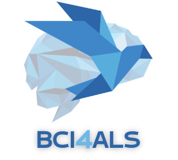

<!-- PROJECT SHIELDS -->
[![Contributors][contributors-shield]][contributors-url] [![Forks][forks-shield]][forks-url] [![Stargazers][stars-shield]][stars-url] 
[![Issues][issues-shield]][issues-url]
[](https://opensource.org/licenses/MIT)


<!-- PROJECT LOGO -->
<br />
<p align="center">
  <a href="https://github.com/arbelna/BCI4ALS">
    
  </a>

  <h3 align="center">BCI for ALS Using EEG P300 Paradigm</h3>

  <p align="center">
    A Brain-Computer Interface (BCI) designed to detect "Yes" or "No" decisions based on visual  and auditory stimuli.
    <br />
    <br />
    <br />
    <a href="https://github.com/arbelna/BCI4ALS">Report Bug</a>
    ·
    <a href="https://github.com/arbelna/BCI4ALS">Request Feature</a>
  </p>
</p>

<!-- TABLE OF CONTENTS -->
<details open="open">
  <summary>Table of Contents</summary>
  <ol>
    <li>
      <a href="#about-the-project">About The Project</a>
      <ul>
        <li><a href="#built-with">Built With</a></li>
      </ul>
    </li>
    <li>
      <a href="#How to use">Getting Started</a>
      <ul>
        <li><a href="#prerequisites">Prerequisites</a></li>
        <li><a href="#installation">Installation</a></li>
      </ul>
    </li>
    <li><a href="#usage">Usage</a></li>
  </ol>
</details>

<!-- ABOUT THE PROJECT -->
## About The Project

The project aim is to empower individuals with ALS, facilitating communication through the development of a Brain-Computer Interface (BCI) that utilizes EEG technology. By leveraging the P300 paradigm, our system can interpret whether a user is signaling "yes" or "no" in response to visual and auditory stimuli, enhancing their ability to communicate effectively.
Here we present you with our year long work where we developed a entire system from scratch from data collecting through preproccesing and training and searching the best model for the task. 

### Built With

- [BrainFlow](https://brainflow.org/)
- [scikit-learn](https://scikit-learn.org/)
- [MNE](https://mne.tools/)
- [PsychoPy](https://www.psychopy.org/)
- [OpenBCI GUI](https://github.com/OpenBCI/OpenBCI_GUI)


<!-- GETTING STARTED -->
## Getting Started

To begin using this project, follow the steps below:

### Prerequisites

- [Python v. 3.7 or above](https://www.python.org/downloads/)
- [OpenBCI GUI (recommended)](https://openbci.com/index.php/downloads)

### Installation

1. Install necessary Python libraries:
   ```sh
   pip install brainflow scikit-learn mne psychopy


<!-- USAGE -->

## Usage

Use the classes we've designed in the following sequence:

1.  **Data Collection**: Utilize the `eeg` and `experiment` classes to conduct experiments and gather data. Execute the `run_experiment` script to initiate the process.
2.  **Preprocessing**: Implement the `mne_preprocessing` class and run the `preprocess` script to process the collected data.
3.  **Modeling**: Engage the `P300_Model` class and execute the `run_model` script. This allows for both grid search operations and model testing.
4.  **Validation**: For validating the model with your data, utilize the `loo` script to perform a 'leave-one-out' test.
5.  **Predictions** Adjust the  run_expiriment script to use your chosen model and get live predictions

**Disclaimer**: Currently, our preprocessing and model assume that each record contains only one block. Adjustments to the code are needed to process multiple blocks simultaneously.
<!-- Contributing -->
## Contributing

The open-source community thrives on active collaboration and contributions. We truly appreciate and welcome any and all efforts to improve and enhance this project. Here's how you can contribute:

### Step 1: Fork the Repository
Start by forking the repository to your own GitHub account. This allows you to experiment freely without affecting the original project.

### Step 2: Create a Feature Branch
Always work in a branch specific to the feature or fix you are implementing. This keeps your changes organized and isolated.
```sh
git checkout -b feature/YourFeatureName
```
### Step 3: Commit Your Changes
Once you have made the necessary changes, commit them with a clear and meaningful message, describing the purpose of the commit.
```
git commit -m 'Add some YourFeatureName'
```
### Step 4: Push to Your Branch
Push the changes to your forked repository on GitHub.
```
git push origin feature/YourFeatureName
```

### Step 5: Open a Pull Request
Return to your fork on GitHub, and you'll see a New Pull Request button next to your branch. Click on it to start the process to get your changes merged into the main project.

Ensure that your changes do not introduce any errors or bugs. We encourage you to write tests whenever possible!

Thank you for your interest and efforts in enhancing our project!


## Contact
<!-- Itamar Avitan's details -->
**Itamar Avitan** [![LinkedIn][linkedin-shield]](https://www.linkedin.com/in/itamar-avitan/) [![Gmail][gmail-shield]](mailto:Itamar811@gmail.com)

<!-- Ido Gurevich's details -->
**Ido Gurevich** [![LinkedIn][linkedin-shield]](https://www.linkedin.com/in/ido-gurevich-704167239/) [![Gmail][gmail-shield]](mailto:idogurevich20@gmail.com)

<!-- Nadav Arbel's details -->
**Nadav Arbel** [![LinkedIn][linkedin-shield]](https://www.linkedin.com/in/nadav-arbel-83b9b4234/) [![Gmail][gmail-shield]](mailto:nadav.arbel05@gmail.com)

<!-- Yoav Noah's details -->
**Yoav Noah** [![LinkedIn][linkedin-shield]](https://www.linkedin.com/in/yoavno/) [![Gmail][gmail-shield]](mailto:yoav1131@gmail.com)

<!-- Adva Feldman's details -->
**Adva Feldman** [![LinkedIn][linkedin-shield]](https://www.linkedin.com/in/adva-feldman-8b49171b9/) [![Gmail][gmail-shield]](mailto:adva430@gmail.com)


<!-- ACKNOWLEDGMENTS -->
## Acknowledgments

While our work is original, we took inspiration from various sources and would like to thank the following:

* [BrainFlow Community](https://brainflow.org/)
* [scikit-learn Community](https://scikit-learn.org/)
* [MNE-Python Developers](https://mne.tools/)
* [PsychoPy Contributors](https://www.psychopy.org/)
* [OpenBCI Community](https://github.com/OpenBCI/OpenBCI_GUI)

We also extend our gratitude to our mentors and peers for their guidance and invaluable feedback.

<!-- LICENSE -->
## License

Distributed under the MIT License. See `LICENSE` for more information.


<!-- MARKDOWN LINKS & IMAGES -->
[contributors-shield]: https://img.shields.io/github/contributors/arbelna/BCI4ALS.svg?style=for-the-badge
[contributors-url]: https://github.com/arbelna/BCI4ALS/graphs/contributors
[forks-shield]: https://img.shields.io/github/forks/arbelna/BCI4ALS.svg?style=for-the-badge
[forks-url]: https://github.com/arbelna/BCI4ALS/network/members
[stars-shield]: https://img.shields.io/github/stars/arbelna/BCI4ALS.svg?style=for-the-badge
[stars-url]: https://github.com/arbelna/BCI4ALS/stargazers
[issues-shield]: https://img.shields.io/github/issues/arbelna/BCI4ALS.svg?style=for-the-badge
[issues-url]: https://github.com/arbelna/BCI4ALS/issues
[license-shield]: https://img.shields.io/github/license/arbelna/BCI4ALS.svg?style=for-the-badge
[license-url]: https://github.com/arbelna/BCI4ALS/blob/main/LICENSE
[linkedin-shield]: https://img.shields.io/badge/-LinkedIn-black.svg?style=for-the-badge&logo=linkedin&colorB=555
[linkedin-url]: https://linkedin.com/in/arbelna

[linkedin-shield]: https://img.shields.io/badge/-LinkedIn-black.svg?style=for-the-badge&logo=linkedin&colorB=555
[gmail-shield]: https://img.shields.io/badge/-Gmail-red?style=for-the-badge&logo=gmail&colorB=D14836
